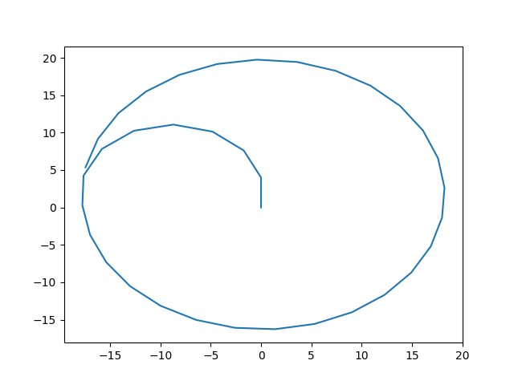
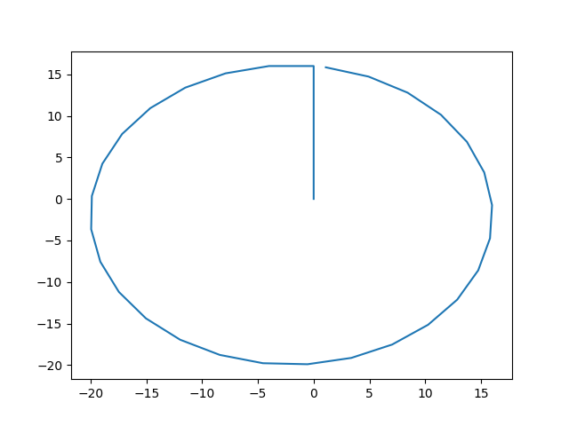
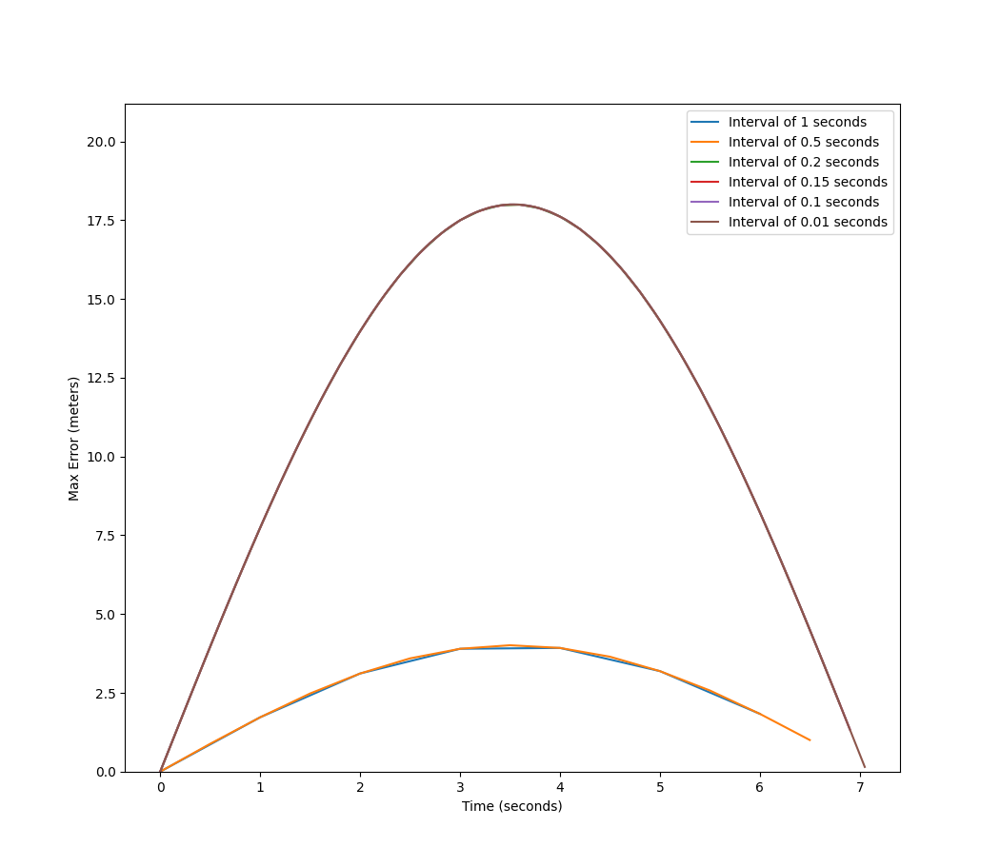

# Running the Code

Install all dependencies with `pip install -r requirements.txt`. Then run the code with `python main.py`.

# Commentary

## Part A

The ackermann model simply needs to get from the center of the outer circle to the edge in order to traverse the circumference. To do this as efficiently as possible, we calculated the inner circle alpha of 1.492 radians and went along that angle until we reached the edge of the larger 18m circle. Once there we traversed the circle on an alpha of 1.415 radians.

For these calcuations we used equations 1.1, 1.7abc, and 1.11 ab from [Mobile Robotics](<./Mobile%20Robots-pages-16-25%20(1).pdf>)

Our output is below:

Figure 1

## Part B

This used the same core logic as part a, but with a skid steer vehicle we were able to directly move to the radius, rotate 90 degrees, and traverse the circle.

The skid steer has a more hexagonal shape than the ackermann model, which has to do with the difference in the equations used, where both a vRight and vLeft are calculated.

Figure 2

## Part C

The maximum error occurred around 3.5 seconds on all 3 intervals. This is likely due to the overall propogation of previous errors up to that point, and is reduced as the vehicle turns back closer to the beginning positions.

The total error and time taken are below:

| Interval | Total Error | Maximum Error | Time to Compute |
| -------- | ----------- | ------------- | --------------- |
| 1        | 17.686      | 3.92          | 0.00            |
| 0.5      | 35.881      | 4.01          | 0.00            |
| 0.2      | 404         | 17.992        | 0.00            |
| 0.15     | 539.72      | 17.992        | 0.00            |
| 0.1      | 809.404     | 17.998        | 0.00            |
| 0.01     | 8099.923    | 17.999        | 0.01            |

As you can see, this is computed quickly and the maximum error is almost the same at 0.1 as at 0.01. We also added the additional timestep 0.5 to more clearly see the difference between 0.1 and 0.01.

Also, notice how 0.1 and 0.01 cannot be distingushed on the graph. This is due to total difference between values at 0.1 and 0.01 error to be
2.48e-14. Interval 0.01 has 10x more error than 0.1, but that's because it is measuring 10x the number of intervals which are all generally off by the same amount. To reduce error we could increase the HZ on the actual vehicle as it navigates the circle to keep it closer to the ideal path.

Figure 3
