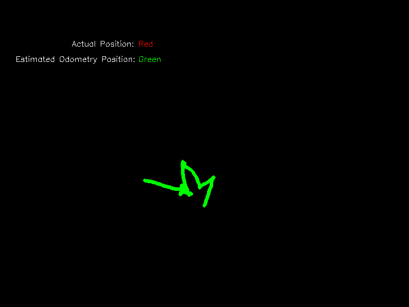

## Part A:
Eventually, we were defeated by this implementation. Below is a list of the things we tried to get this program to run:
* Ran 'python train_crop_velocity.py' - resulted in ModuleNotFoundError: No module named 'correlation_cuda'
* Downloaded cuda for windows
* Navigated to networks/correlation and ran 'python setup.py build' - resulted in   File "C:\Python311\Lib\site-packages\pkg_resources\_vendor\packaging\version.py", line 264, in __init__
    match = self._regex.search(version)
            ^^^^^^^^^^^^^^^^^^^^^^^^^^^
TypeError: expected string or bytes-like object, got 'NoneType'
* Edited C:\Python311\Lib\site-packages\pkg_resources\_vendor\packaging\version.py to be self._regex.search(str(version))
* Re-ran 'python setup.py build' - resulted in RuntimeError:
The detected CUDA version (12.3) mismatches the version that was used to compile
PyTorch (None). Please make sure to use the same CUDA versions.
* Uninstalled torch and reinstalled it, got: AttributeError: 'LegacyVersion' object has no attribute 'major'
* Decided to try WSL: installed cuda and torch (torch broke wsl, had to restart computer, was successfully installed on 2nd try).
* Ran 'python setup.py build' - result: 'raise RuntimeError(message) from e
RuntimeError: Error compiling objects for extension
* Pulled out old laptop with Linux Mint, downloaded repo, downloaded dependencies, ran 'python setup.py build'. Result: 'raise RuntimeError(message) from e
RuntimeError: Error compiling objects for extension

#### Merits of the Algorithm

#### How it works

## Part B:
It took a while to get this to work properly - ultimately, we found success when using opencv-python version 3.4.17.61. Additionally, contrary to advice we received, it was not sufficient to provide the first line of pose data - the program expected pose data per frame. Given that none of us has a camera that generates pose data, and any attempt to recreate it would be marginally successful at best, we decided to remove that component of the program altogether. The path taken was a rectangle.

The video used for this question is too large to upload to github, so I have published it on my google drive account, and it is accessible [here](https://drive.google.com/file/d/1UhxoTC_4qIo-FAB6tTEa8wwIuOE9bcX_/view?usp=sharing)

Another obstacle we encountered was that, for some reason, some of the frames caused the program to crash. We automated the process of removing frames, and in all, about 100 of the ~12,000 frames were deleted. This may have marginally contributed to the inacuraccy of the map shown below.

More than that, however, I think the inacuraccy of this map is due to the limitation of monocular odometry in general. I used a relatively high-resolution camera with a relatively high frame rate. I walked in a regular path, and held the camera fairly steady. I would suspect that, for the most part, the map missed the mark because monocular odometry is, without any other points of reference, inaccurate to begin with.

It is possible that the venue of the video futher contributed to the map's inaccuracy. I recorded the video in the cemetary, where the majority of the landmarks are trees of a similar size and shape. I would have expected this algorithm to be able to compensate for that, but it is possible the environment was a contributing factor.

Below, you can find both the original trajectory image, and below that you can see the original trajectory image overlayed with an approximation of the actual path taken.

 

 

