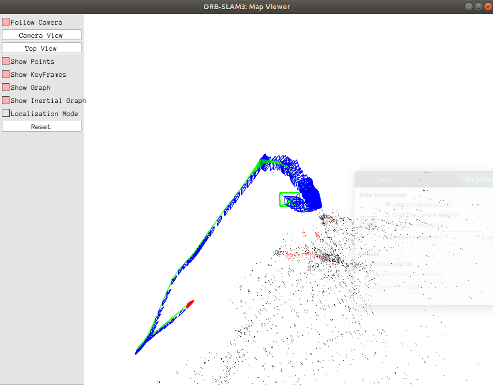

## Part A
In general, it is a bad idea to rely on a single sensor for localization. No piece of hardware is infallible, so if the single sensor in use is reporting inaccurate data, there will be nothing to indicate the data is incorrect. Additionally, even if the data is correct, it is impossible to have a high degree of confidence in the data without at least one (and preferrably more) point(s) of reference against which to compare the data. Worse, many of these issues compound over time, resulting in a robot that cannot be trusted to localize itself.

Expanding the question to using a single type of sensor (i.e. allowing 5 sensors on a robot, but they are all cameras), there are still inherent issues. As will be shown below, each sensor type has areas where it falls short. In order to ensure greatest localization accuracy, it is best to use a variety of different sensors in conjunction with each other.

Disadvantages of:

- IMU
    - An IMU measures data relative to itself. This means that any error affects not only that particular reading - every subsequent reading is off by the same amount.
    - IMUs are susceptible to impacts and vibrations, meaning that collisions - or potentially even a nearby train or other large vehicle that causes a slight tremor - will cause inaccuacies. 
    - IMUs are limited to where the robot has been and what it's done - they can register the past, but cannot provide any information regarding the surroundings of the robot. They can be useful for localization, but have little to no use in planning.

- Sonar/Ultrasonic
    - While sonar can provide information about surroundings, the accuracy of these readings can be significantly reduced by interference from ambient noise - or even other ultrasonic sensors.
    - Sonar is limited by distance - the farther away an object is, the less reliable the reading will be.

- GPS
    - GPS accuracy can be significantly reduced - or even blocked entirely - by external obstructions such as trees, buildings, or tunnels.
    - The level of accuracy from GPS is acceptable for outdoor spaces, where general location is more important than pinpoint precision. According to gps.gov, smartphone GPSs are accurate to within ~16 feet, and high-end GPS sensors can improve that accuracy to within a few centimeters. However, for some use-cases, even that precision may be insufficient.
    - There can be noticeable latency from GPS data.
    - GPS is, for now, bound to Earth. Any extraterrestrial robot will not be able to use GPS.

- Monocular Camera
    - Monocular cameras rely on features in the environment - feature which may be mobile, or which could look different depending on lighting or other environmental features.
    - Monocular cameras aren't great at scale without additional information
    - Monocular cameras can also be confused by repetetive textures or features in the environment.

## Part B
A few notes on part B:
- It took me 15+ hours to get Orbslam installed and configured with all of the proper dependencies (eventually after trying to install it and its dependencies at least 4 times, I used a virtual machine running a docker image).
- The camera calibration process provided marginal improvements, but ultimately did not fix all of the inaccuracies.
- In fact, the accuracy is pretty abysmal. I walked pretty much in a perfect square, and got the below result.
- Ultimately, this was the best accuracy and map I could obtain. I have included the original video, a screenshot of the final map, and the text files (found in orbslam_data in this directory, called f_dataset-midterm_mono.txt and kf_dataset-midterm_mono.txt) generated by the process.

## Part C
1 Long-Range Radar:
- Looking at the Ouster OS-2, a long-range radar sensor marketed for autonomous vehicles, [this website](https://www.geoweeknews.com/news/ouster-launches-3-5k-16-channel-lidar-64-channel-sensor-longer-range) reports the price as $24,000 per unit.

6 LIDAR
- [Texas Instruments](https://www.ti.com/lit/wp/slyy150b/slyy150b.pdf?ts=1697012064674&ref_url=https%253A%252F%252Fwww.bing.com%252F) is of the opinion that the average LIDAR sensor runs for ~\$10,000. While Luminar promises to drop that cost to \$1,000 or even \$500, I will wait until they deliver to use that figure. For now, I will assume $10,000 for one very capable lidar.

4 Camera
- Assuming use of Intel's [Realsense Depth Camera D457](https://store.intelrealsense.com/buy-intel-realsense-depth-camera-d457.html), each camera would cost $500, coming out to $2,000 for all 4 cameras.

7 Short-/Medium-Range Radar
- Using Velodyne's VLP-16 Puck, the cost per unit is around [\$4,000](https://www.thedrive.com/tech/17297/velodyne-just-cut-the-price-of-its-most-popular-lidar-sensor-in-half). For 7 units, that comes to $28,000

Adding this all up results in \$24,000 + \$10,000 + \$2,000 + \$28,000 = \$64,000 USD
