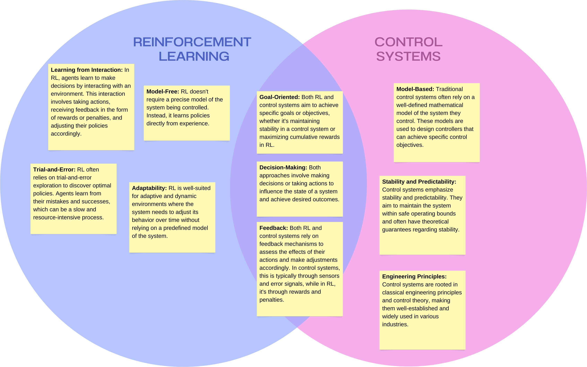

# Question 5

## Part A

Explain three merits and three demerits of using reinforcement learning for mechatronic systems.

### Merits

1. Adaptive Control: RL enables mechatronic systems to learn and adapt to changing environments and requirements. This adaptability is valuable in scenarios where traditional control methods may struggle to cope with dynamic or uncertain conditions.

2. Autonomous Decision-Making: Mechatronic systems equipped with RL can make autonomous decisions to achieve specific goals. This is particularly useful in applications such as robotics, where the system must navigate and interact with its environment without constant human intervention.

3. Complex System Optimization: RL can be used to optimize complex, non-linear systems with high-dimensional state and action spaces. It can learn optimal control policies that maximize rewards, making it suitable for tasks like optimizing the energy efficiency of a mechatronic system or fine-tuning controller parameters.

### Demerits

1. High Computational Requirements: Training RL models can be computationally intensive, requiring significant computational resources, time, and data. This can be a practical limitation, especially for real-time or resource-constrained mechatronic systems.
2. Limited Sample Efficiency: RL algorithms often require a substantial amount of trial-and-error exploration to learn effective policies. In some cases, this extensive exploration can be impractical or even dangerous, particularly in applications where mistakes can lead to damage or safety hazards.
3. Lack of Guaranteed Stability: Traditional control methods often come with theoretical guarantees of stability and performance. RL, on the other hand, typically lacks such guarantees. Ensuring the stability of a mechatronic system using RL can be challenging, and additional safety mechanisms may be necessary.

## Part B

Draw a diagram that contrasts reinforcement learning and controls.

## Part C

rightForcefulCartpole.py contains the cartpole simulation with the right aggressive force as 50% more than the left.

See the code for both the frozen lake and the cartpole with an aggressive right in this directory.
