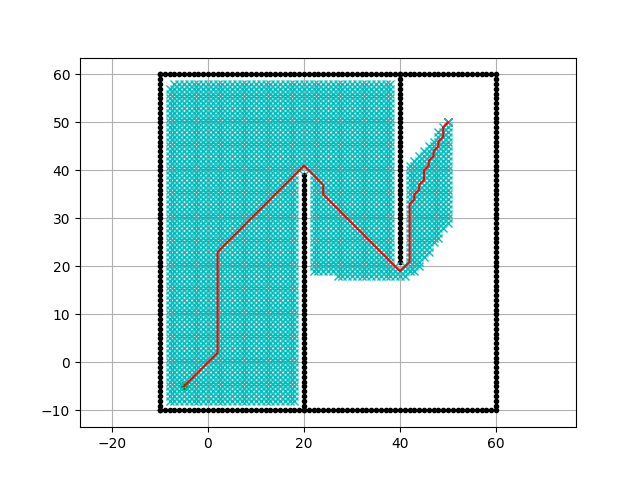

## Part A

Comparison of the various algorithms over 10 iterations (no animation).
| Algorithm | Time (s) | Path Cost |
|---|---|---|
| Dijkstra | 0.33 | 121.78 |
| A Star | 0.39 | 121.78 |
| BFS | 0.33 | 121.78 |
| Bidirectional | 0.39 | 122.37 |
| RRT Star | 4.83 | 25.86 |

Cleary, the RRT Start takes by far the longest, however it has the shortest path between each point. The other algorithms are all very similar in time and in length, but CusomtBidirectional is slightly slower and has a slightly longer path.

Comparison with animation:
| Algorithm | Time (s) | Path Cost |
|---|---|---|
| Dijkstra | 67.93 | 121.78 |
| A Star | 34.68 | 121.78 |
| BFS | 63.36 | 121.78 |
| Bidirectional | 12.43 | 122.37 |
| RRT Star | 56.62 | 22.77 |

Once we have the animation to illustrate better how these algorithms are working, it is apparent that RRT Star is the best. Bidirectional is the fastest because it can come from both sides, while great to find a path, this is not super realistic for a robot because it would need to know both locations and jump between them in order to find the optimal path.

RRT Star does take 56 seconds, but Dijkstra and BFS still take longer and have 6x the cost.

How we calculated the path cost, where rx is the path of x coordinates and ry is the path of y coordinates.

```python
def analyzeCost(rx, ry):
    cost = 0
    for i in range(len(rx) - 1):
        cost += math.hypot(rx[i] - rx[i + 1], ry[i] - ry[i + 1])
    return cost
```

### Follow Up Questions

A. The RRT Star algorithm is the most efficient in terms of path cost, but it is the slowest in terms of time.
B. The fastest algorithm was the Bidirectional planner, with a second place win for Dijkstra.
C. Our custom A\* does not fully take advantage of heuristics to speed up the search. It would be helpful to favor the algorithm to go towards where there is open space. RRT clearly shows that moving along the path in a minimal number of turns is the most efficient way to get to the goal. More aggressive convergence reduces the time and path cost.
D. The best overall planner would be either A star or RRT Star. A star works so much faster, but requires a lot more back tracking and searching. RRT Star is slower, but it is more efficient in terms of path cost. In practice, it seems like RRT would end up being faster because it would be difficult to do so many small maneuvers on the robot for an A star or Dijkstra path.

Graphs:

#### A Star



#### BFS


#### Dijkstra


#### Bidirectional


#### RRT Star


## Part B

In identifying an algorithm we must recognize a few things: 1) That there are still obstacles that cannot be crossed regardless of elevation. 2) That the cost to move up and down is not equal. If we can move down it is cheaper than moving left or right. 3) That we can only move up or down one unit at a time. This makes something like RRT Star more challenging because it works better on longer paths.

In addition, we want the cheapest path, not the necessarily the shortest. If we optimize for cost rather than distance something like Dijkstra or A\* may be better, because they check the neighbors much more frequently than RRT Star.

### Selction: A Star

#### How We Would Modify the Algorithm

The heuristic function should estimate the cost from a given state to the goal state. In this case, a good heuristic would be the cost based on the elevation difference. For example, you can use the absolute elevation difference between the current state and the goal state. This encourages the algorithm to prioritize paths that involve less elevation change.

Cost function: Define the cost function that calculates the cost of moving from one state to another. For flat terrain, the cost is 1, for moving uphill, it's 2 (1 for traversal + 1 for elevation), and for moving downhill, it's 0.5 (1 for traversal - 0.5 for elevation). Ensure that the cost function accounts for the terrain elevation.

The priority queue should be based on total cost (g + h) rather than distance (g).

### Optimal Path on Given Map

Cost: 10 (assumes we start at elevation 1 and goal state of 1. It is ambigous in the document, so we said any elevation is an upcharge of 1 and any down is a discount of 0.5; ie 1 -> 3 is a cost of 2 and 1 -> is also a cost of 2.)

Green shows a path with cost of 10.5, and the optimal is in blue with a cost of 10. We show both to show that the algorithm is working.


### Optimal Path if normal traversal is 2

If the cost to traverse is 2, then the optimal path is shown below:


### Assumptions

Different elevations would change the speed proportional to gravity. If we are on an earth-like planet then gravity will speed up the robot as it goes down and slow down the robot as it goes up. In a close to zero gravity environment, the robot would still be affected, but almost unnoticeably.

A general overview of the A star algorithm:

It takes in a start position and looks at the available neighbors. From those neighbors we take a relative cost (which takes into account the elevation), and then we add that cost to the distance towards the goal. We then put that onto a priority queue where the best combination of closeness and lowest cost appears. We then repeat that process and throw the values onto the queue.

This algorithm makes sure we are moving towards the goal and that we are following along an optimized path (in this case for cost).

Our approach to optimizing the path is summed up by this function:

```python
def heuristic(pos, goal):
    return abs(pos[0] - goal[0]) + abs(pos[1] - goal[1])
```

And

```python
    g_score[(new_x, new_y)] + heuristic((new_x, new_y), goal),
```

where `g_score` is the elevation cost.

The more elevation change affects how we charge the move. These values can be adjusted in the calculate_move_cost function (ex: from cost of 1 to cost of 2 for moving). Using this customization we could find a great path in almost every environment.


