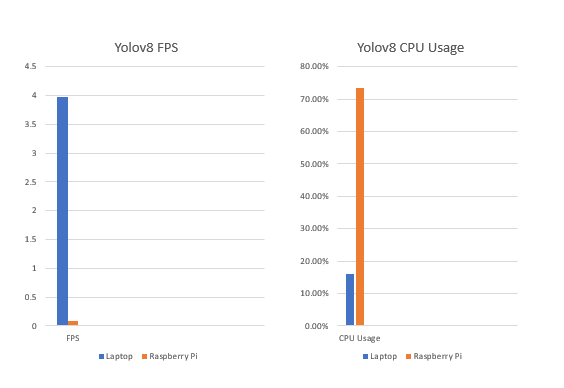

# Question 8

## Part A

For this section I deployed the Faster R-CNN model. It can be found in the directory FasterRCNN, to run the classification create new virtual environment `(python3 -m venv .venv)` and install everything in the `./FasterRCNN/tf2/requirements.txt` file.

Then run the following command from within the FasterRCNN:

```bash
python -m tf2.FasterRCNN --load-from=./fasterrcnn_tf2.h5 --predict-all-directory=./grocerystore
```

The results will be saved in the `FasterRCNN/detections` directory. I have already pushed all the output to the repo so you can see the results there without running the code.

## Part B

I have deployed both versions of yolo, they can be found in the directories `yolov5` and `yolov8`. For the yolo version I implemented both

1. image classification
2. object detection.

There are separate files to run and output directories for each of these functions.

### YoloV5

For yolov5 you must create a new virtual environment and install the requirements in the `./yolov5/requirements.txt` file. Then run the following command from the yolov5 directory: `python detect.py` for detection or `python classify/predict.py`.


The results will be stored in `yolov5/runs/detect/detections` and `yolov5/runs/predict-cls/classifications` respectively.

### YoloV8

For yolov8 you must first again create a virtual environment, and this time install the requirements in the `./yolov8/requirements.txt` file. Then run the following command: `python detect.py` for detection or `python classify.py` for classification.

The results will be stored in `yolov8/ultralytics/detections` and `yolov8/ultralytics/classifications` respectively. Again I have already run the programs and the results are in the repo for you to view.

## Part C

I deployed the yolov8 model on the raspberry pi with a subset of the images.

On my laptop (12GB ram, 11th gen intel i5-1135G7 @ 2.40GHz) the subset was classified at 3.97 frames per second and 16.11% cpu usage.

On the raspberry pi 3 the performance was 0.08 frames per second and 73.51% cpu usage.

A chart comparing the performance between the two devices is below


